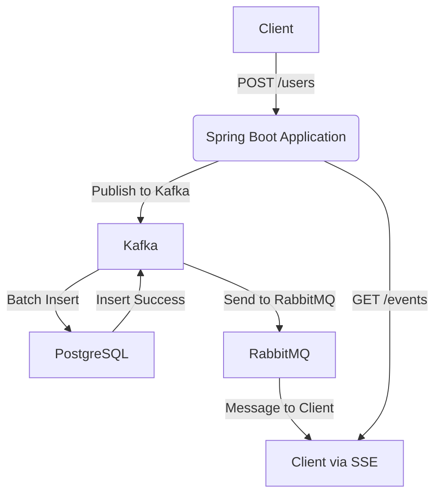

# Spring Boot, Kafka, RabbitMQ, dan PostgreSQL dengan Docker Compose

## Diagram Arsitektur



Proyek ini adalah contoh aplikasi Spring Boot yang menggunakan Kafka untuk batch insert ke PostgreSQL dan RabbitMQ untuk mengirim pesan ke klien jika POST berhasil diterima oleh Kafka. Aplikasi ini juga menyediakan event streaming dengan Server-Sent Events (SSE) untuk memantau status pembuatan pengguna.

## Konsep

- **Spring Boot**: Aplikasi utama yang mengelola CRUD operasi untuk pengguna.
- **Kafka**: Digunakan untuk batch insert data pengguna ke PostgreSQL.
- **RabbitMQ**: Mengirim pesan ke klien ketika operasi POST berhasil diterima oleh Kafka.
- **PostgreSQL**: Database yang menyimpan data pengguna.
- **SSE (Server-Sent Events)**: Digunakan untuk mengirim status pembuatan pengguna ke klien secara real-time.


## Cara Menjalankan Aplikasi

### Prasyarat

- Docker dan Docker Compose
- JDK 11 atau lebih baru
- Maven

### Langkah-langkah

1. **Clone Repository**
    ```sh
    git clone <repository-url>
    cd <repository-directory>
    ```

2. **Bangun Aplikasi**
    ```sh
    ./mvnw clean install
    ```

3. **Jalankan Docker Compose**
    ```sh
    docker-compose up
    ```

4. **Akses Aplikasi**
    - **Spring Boot Application**: [http://localhost:8080](http://localhost:8080)
    - **RabbitMQ Management Console**: [http://localhost:15672](http://localhost:15672) (username: `guest`, password: `guest`)
    - **Kafka Drop**: [http://localhost:9000](http://localhost:9000)

5. **Uji Endpoint SSE**
   Buka browser dan akses [http://localhost:8080/sse.html](http://localhost:8080/sse.html) untuk memantau status pembuatan pengguna.

6. **Uji Endpoint API**
   Gunakan Postman atau alat serupa untuk mengirim permintaan POST ke `http://localhost:8080/users` dengan data pengguna.


Dengan mengikuti langkah-langkah di atas, Anda seharusnya dapat menjalankan aplikasi Spring Boot dengan Kafka, RabbitMQ, dan PostgreSQL menggunakan Docker Compose dan mengakses event streaming menggunakan SSE.


